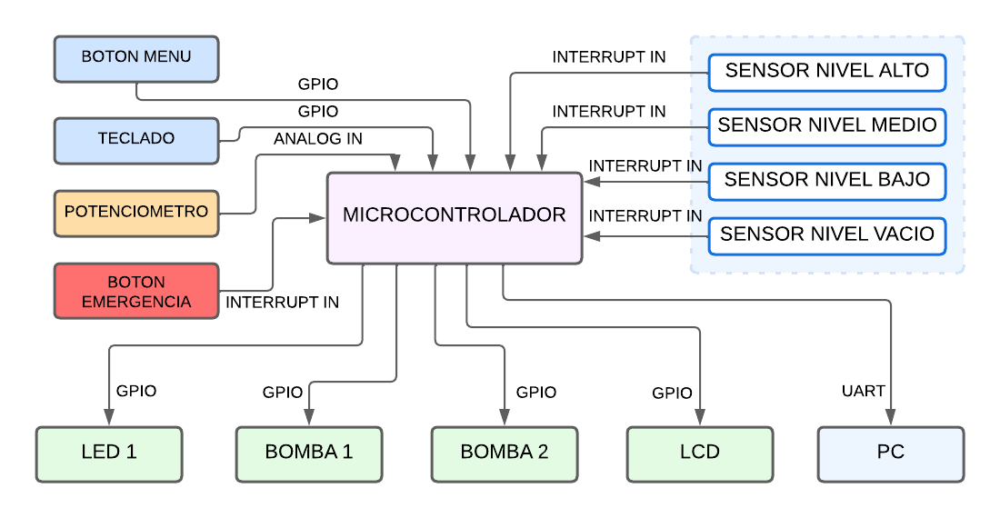

---

# ArmBookCurso2024

## **Título:** Control de Sistema de Tratamiento de Agua

### **Alumno:** Jesús García

### **Objetivo:**  
Desarrollar un sistema de monitoreo y control para un proceso de tratamiento de agua.

### **Descripción:**

Este sistema controla el suministro y la producción de agua ultrapura mediante un tratamiento por ósmosis inversa. Utiliza diferentes módulos y periféricos para monitorear la presión y gestionar las bombas, optimizando el proceso de tratamiento de agua y garantizando su seguridad y eficiencia.

### **Componentes del sistema:**

1. **Módulo `control_system`:**  
   Inicializa el panel de control y actualiza el sistema constantemente.

2. **Módulo `panel_control`:**  
   Interactúa con los siguientes módulos:
   - `buttons`: Gestiona la interacción con el usuario mediante botones.
   - `display`: Muestra la información del sistema en la pantalla.
   - `matrix_keypad`: Permite la entrada de datos mediante un teclado 4x3.
   - `pressure_sensor`: Monitorea la presión de entrada y salida del sistema.
   - `pumps`: Controla el funcionamiento de las bombas.
   - `serial_communication`: Comunica información sobre el sistema mediante UART.

### **Funcionamiento:**

El sistema monitorea dos presiones clave:
- **P1:** Presión de entrada (antes de los filtros).
- **P2:** Presión de salida (después de los filtros).
- **SENSOR NIVEL HIGH:** Se verifica cambio de estado para parar llenado del tanque.
- **SENSOR NIVEL MEDIUM:** Se verifica cambio y estado de sensores.
- **SENSOR NIVEL LOW:** Se verifica cambio y estado de sensores.
- **SENSOR NIVEL EMPTY:** Se verifica cambio y estado de sensores, en caso tal realiza paro de emergencia.

el sistema controla el encendido y apagado de las bombas para evitar condiciones peligrosas como la falta de agua o sobrepresión.

### **Interacción con el usuario:**

El usuario puede interactuar con el sistema mediante un botón que, al ser presionado de manera extendida, despliega un menú serial con las siguientes opciones:

1. **Ajustar Frecuencia de la Bomba:**  
   Permite ingresar la frecuencia de operación de las bombas mediante el teclado de 4x3.

2. **Verificar Estado del Sistema:**  
   Imprime las variables de estado del sistema en la pantalla.

3. **Detener Sistema:**  
   Detiene el funcionamiento de las bombas de manera segura.

### **Operación del sistema:**

- **Bombas P1 y P2:**  
  Funcionan dentro de los rangos de presión mínima y máxima.  
  La bomba P1 está controlada por la presión de entrada, mientras que P2 se controla por la presión de salida.

- **Pantalla LCD:**  
  Muestra el estado de cada variable del sistema, actualizándose periódicamente.

- **Estado de nivel del tanque**  
  Muestra el estado del tanque, actualizándose periódicamente.

- **Paro de emergencia**  
  Permite desactivar totalmente el sistema segun estado del sistema o manualmente.

### **Plataforma de desarrollo:**
- **STM32 Nucleo-144**

### **Periféricos utilizados:**

- **USER BUTTON:**  
  Inicia o apaga el sistema.
  
- **LED 1:**  
  Indica un cambio de estado para iniciar el modo menú.

- **LED 2:**  
  Indica el estado de la bomba P1.

- **LED 3:**  
  Indica el estado de la bomba P2.

- **ANALOG IN 1:**  
  Simula un sensor de presión.

- **UART:**  
  Comunica información sobre el estado del sistema a un PC.

- **TECLADO:**  
  Permite navegar en el menú serial e ingresar la frecuencia de las bombas.

- **LCD:**  
  Visualiza los estados de las variables periódicamente.

- **SENSOR HIGH:**  
  Analiza cambios de estado en el sensor permitiendo detener sistema o verificar irregularidades.

- **SENSOR MEDIUM:**  
  Analiza cambios de estado en el sensor permitiendo detener sistema o verificar irregularidades.

- **SENSOR LOW:**  
  Analiza cambios de estado en el sensor permitiendo detener sistema o verificar irregularidades.

- **SENSOR EMPTY:**  
  Analiza cambios de estado en el sensor permitiendo detener sistema o verificar irregularidades.

- **PARO DE EMERGENCIA**  
  Detiene el sistema por un usuario

### **Diagrama en bloques:**

### **Video explicación:**
https://drive.google.com/file/d/1TlJEGdFq1cobqho52rMB-_xHbmAPWIVM/view?usp=sharing
---